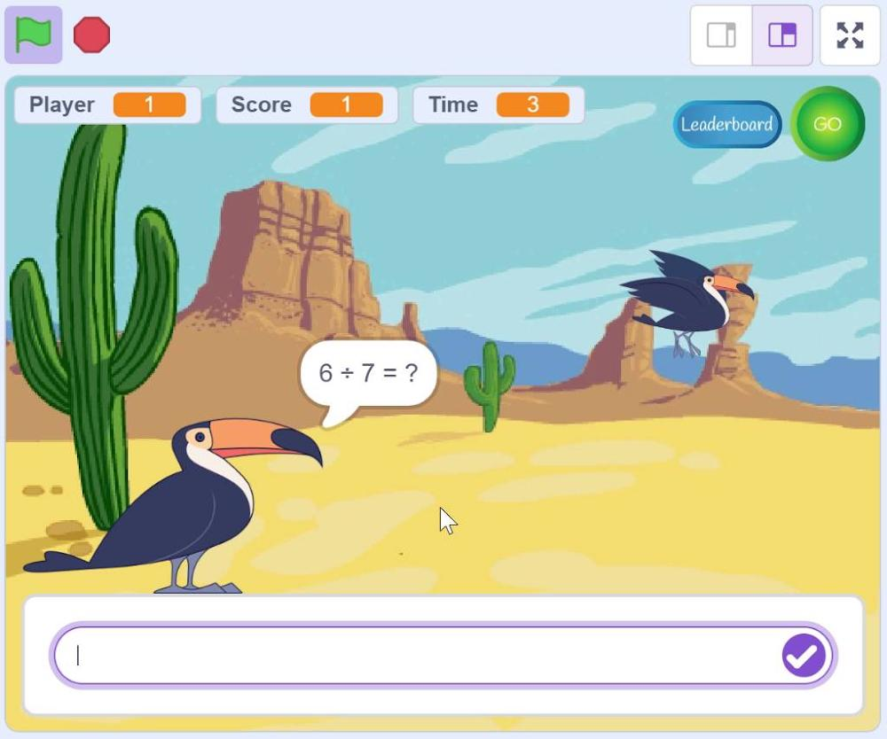

# Bird Math Game

A simple math game built visually using Scratch for kids.

## Overview

This repository contains the source code (`.sb3` file) for my game, designed and programmed entirely within Scratch. It features custom game logic, state tracking, and animations built through block-based programming.

## Features

- **Interactive Mechanics:** [e.g., Smooth player movement and physics-based jumping]
- **Score Tracking:** Uses dynamic variables to track high scores and player states.
- **Custom Assets:** Features tailored backdrops, custom-drawn sprites, and integrated audio cues.

## Screenshots

## How to Play

Since this is a native Scratch project file, you can run it using one of the methods below:

### Method 1: Play via TurboWarp (Fastest)

1. Copy the download link of the `.sb3` file from this repository.
2. Go to [TurboWarp](https://turbowarp.org).
3. Click **File > Load from computer** (or paste the file URL) to run the game smoothly with an unlocked framerate.

### Method 2: Edit in Scratch

1. Download the `.sb3` file from this repository.
2. Go to the [Scratch MIT Editor](https://mit.edu).
3. Click **File > Load from your computer** to view the underlying block script or make modifications.

## Author

H2SO4-1191 – Software Engineer
